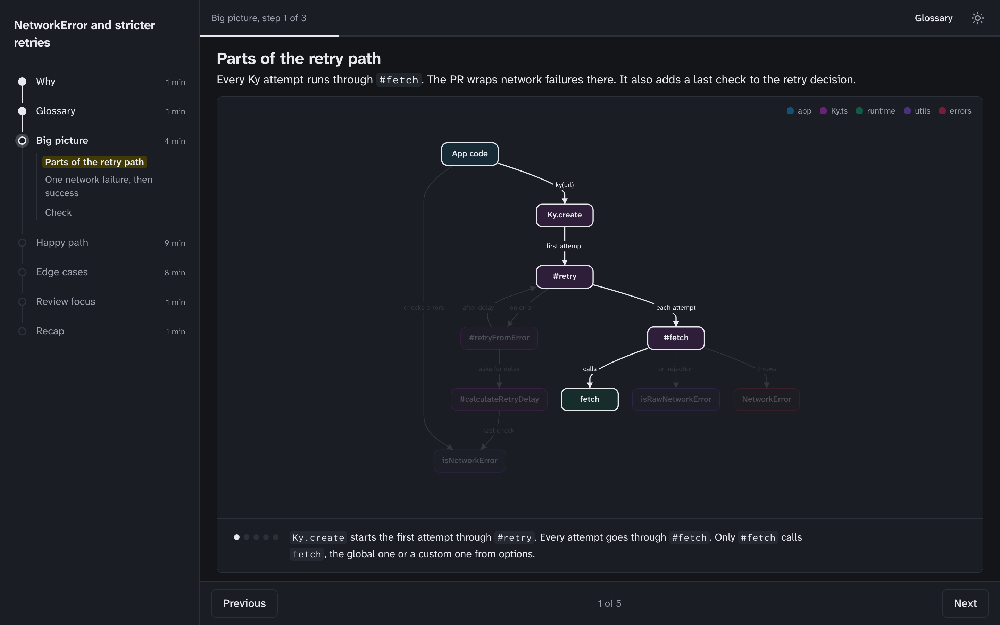
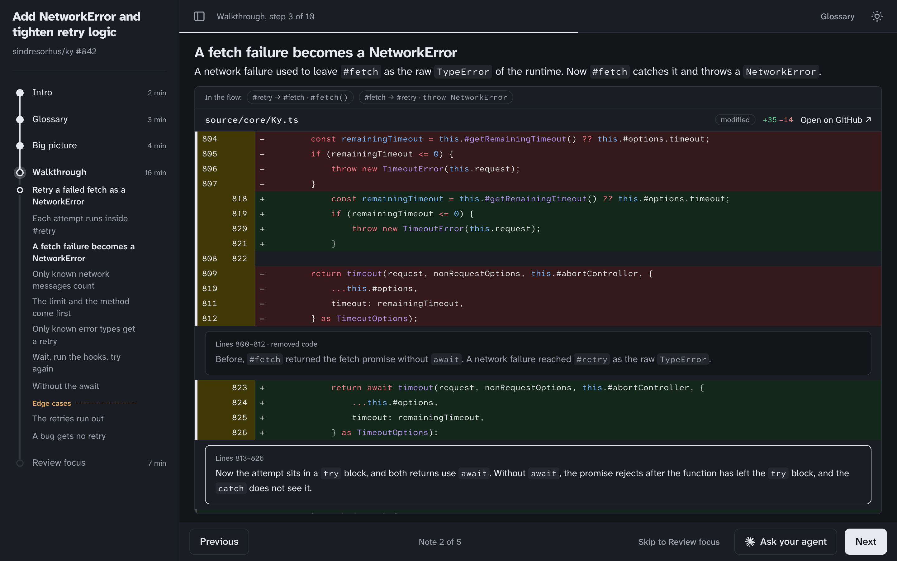
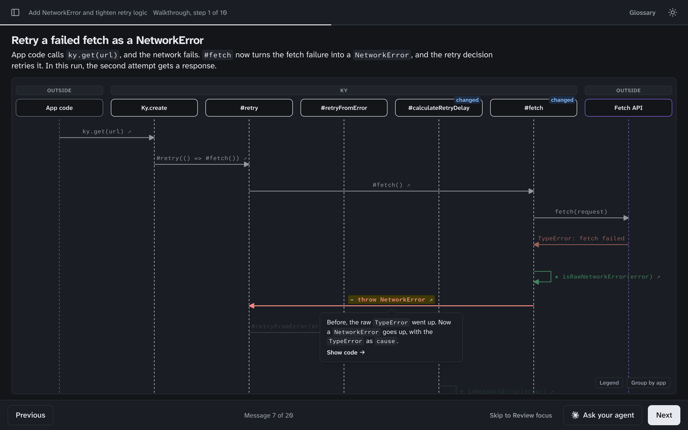

# Dive

Dive is an Agent Skill that turns a pull request, a code module, or a question about your codebase into an interactive walkthrough of the real code.

| Big picture | Code walkthrough | Sequence |
| --- | --- | --- |
|  |  |  |

## Table of contents

- [Why](#why)
- [How it works](#how-it-works)
- [What is in a dive](#what-is-in-a-dive)
- [Usage](#usage)
- [Installation](#installation)
  - [Claude Code](#claude-code)
  - [Codex and Cursor](#codex-and-cursor)
  - [Other agents](#other-agents)

## Why

Coding agents now write a large share of the code we ship. Changes land faster than we can review them in depth, so we skim, merge, and move on. A diff can look fine at a glance and still hide the details that matter.

Other teams move just as fast. The parts of the system you do not own get harder to follow, and so does any work that crosses team lines. Over time we understand less of our own systems.

Addy Osmani calls this [comprehension debt](https://addyosmani.com/blog/comprehension-debt/), also known as cognitive debt.

Dive helps you pay it down. It walks you through a change or a part of the domain one step at a time, using the real code, until you understand how it works and why it was built that way.

## How it works

1. The orchestrator reads the scope and plans the key flows in the business logic.
2. Writer subagents run in parallel, one per chapter and one per flow. Each flow writer traces its flow end to end. The intro and review-focus writers also search connected knowledge sources, such as Notion or Slack.
3. `dive.py` checks every step and line range, and builds the page.

## What is in a dive

- Intro with the basic concepts and the motivation.
- Searchable glossary of domain terms.
- Big picture of the change or the domain, with links to each flow.
- Walkthrough of every business flow, each with an interactive sequence diagram and code snippets.
- Short quizzes to check that you follow along :smile:
- An Ask button on every step that opens Claude Code, Cursor, or Codex with a prompt about that step, or copies it.

## Usage

```
/dive 1234                                    # a pull request number
/dive https://github.com/acme/shop/pull/1234  # a pull request URL
/dive src/payments                            # a module
/dive how do refunds get retried?             # a question
/dive src/payments I am new to payments       # say how well you know the domain
```

The dive is written to `docs/dives/<slug>/index.html` and opens in your browser when it is ready. Nothing is committed. For pull requests, your working tree and current branch are left alone.

## Installation

### Claude Code

```
/plugin marketplace add bzurkowski/dive
/plugin install dive@dive
```

### Codex and Cursor

This repo is also a Codex plugin (`.codex-plugin/`, marketplace in `.agents/plugins/`) and a Cursor plugin (`.cursor-plugin/`). Add `bzurkowski/dive` as a plugin source in your agent.

### Other agents

Any agent that reads Agent Skills:

```
npx skills add bzurkowski/dive
```

Or copy `skills/dive/` into the skills directory of your agent.

Requirements: `git` and `python3`. `gh` is optional.
